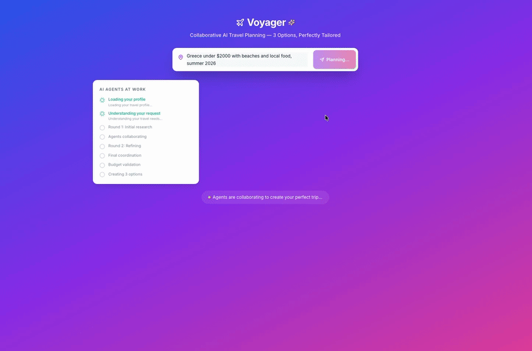
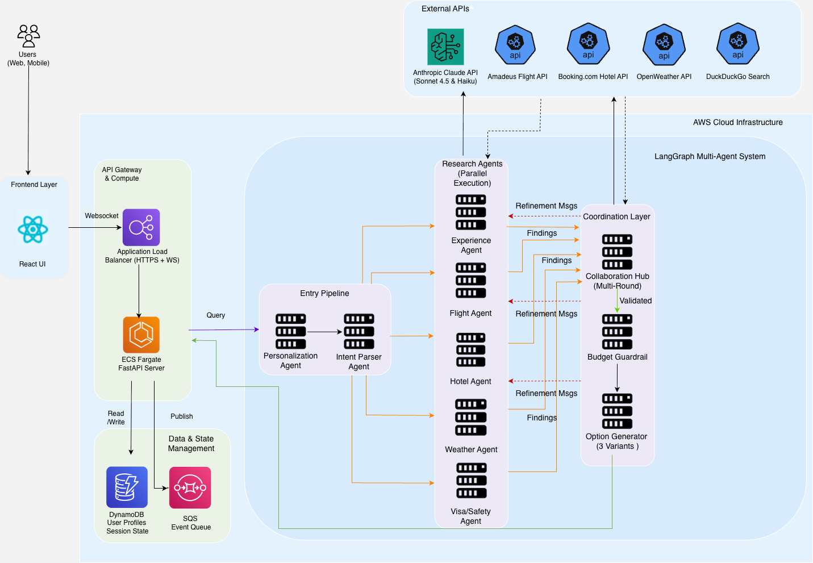

# Voyager — Collaborative Multi-Agent Refinement

[](https://github.com/abhikank90/voyager-travel-agent/actions/workflows/ci.yml)

**A coordination pattern for multi-agent LLM systems: typed conflict detection, targeted peer feedback, and selective re-execution.** Voyager demonstrates the pattern on a real problem — multi-agent travel planning — where parallel specialist agents produce locally optimal but globally incoherent results, and fixes them for ~2% additional cost.

| Metric (25-query benchmark, 2 modes) | Without hub (baseline) | With hub (full) |
|---|---|---|
| Cross-agent conflicts surviving into final output | 2.0 / query | **0.0 / query** |
| Cost per query | $0.129 | $0.131 (**+2.1%**) |
| End-to-end latency | 163.3s | 167.3s (**+2.4%**) |
| Agent calls vs. naive "re-run everything" | — | **−30%** |

*Benchmark methodology, caveats, and reproduction steps in [Benchmarks](#benchmarks).*

---

## Demo



*Watch Voyager generate personalized trip options in real-time as agents collaborate to find flights, hotels, and experiences.*

---

## The Problem

The dominant pattern for multi-agent systems is **parallel fan-out/gather**: decompose a task, run specialist agents concurrently, merge results. It's fast and modular — and it has a structural flaw: **each agent optimizes locally with no knowledge of its peers' outputs.**

In travel planning, that looks like:

- The hotel agent books the best-value hotel — on the opposite side of the destination from every activity the experience agent selected.
- The flight agent picks the cheapest fare — landing at 22:30, wasting the first day of a 7-day trip.
- The experience agent plans beach days — during the week the weather agent flagged a heat wave.

Each output is individually defensible. The combination is incoherent. In our benchmark, **every query** produced at least one cross-agent conflict after the parallel round (2.0 on average) — and in a single-pass architecture, all of them ship to the user.

The well-documented fixes are expensive or imprecise:

- **Sequential pipelines** eliminate conflicts by serializing everything — and give up the latency win of parallelism.
- **Debate / generator-critic loops** re-run *all* agents with broadcast critique until convergence — effective, but cost scales with rounds × agents, and unstructured natural-language critique gives no guarantee the right agent gets the right constraint.

## The Pattern

Voyager inserts a **Collaboration Hub** between research rounds. It does three things, all deliberately narrow:

```
            ┌──────────────────────── Round 1 (parallel) ───────────────────────┐
            │  Flight    Hotel    Experience    Weather    Visa/Safety          │
            └──────────────────────────────┬─────────────────────────────────────┘
                                           ▼
                                 ┌──────────────────┐
                                 │ Collaboration Hub │
                                 │  1. detect typed  │
                                 │     conflicts     │
                                 │  2. route targeted│
                                 │     constraints   │
                                 └────────┬──────────┘
                          conflicts? ──── no ──→ final audit → budget guardrail → options
                                           │ yes
                                           ▼
            ┌────────── Round 2 (selective — only agents that received messages) ─┐
            │            Hotel ✓          Flight ✓        (others skipped)        │
            └──────────────────────────────┬───────────────────────────────────────┘
                                           ▼
                                 (hub re-checks; ≤1 more round)
```

**1. Typed conflict detection (deterministic by design).** The hub checks the merged state against a registry of *typed* conflict rules — `location_mismatch`, `timing_inefficiency`, `weather_activity_mismatch` — each a cheap, deterministic predicate over structured agent outputs. Detection is intentionally rule-based rather than LLM-based: typed conflicts are what make the next two steps possible. You can only route a constraint *to the hotel agent specifically* if you know *structurally* that the conflict is a hotel-location/activity-location mismatch. (The hub does call Claude once per round — to generate a narrative analysis surfaced in the UI; that narrative never drives routing.)

**2. Targeted constraint routing.** Each detected conflict generates a message addressed to the *one agent best positioned to resolve it*, carrying structured data, not prose: the hotel agent receives `{activity_locations: ["Oia, Santorini", ...]}`; the flight agent receives `{preferred_arrival: "before 14:00"}`. This is the inversion of the usual coordinator pattern — instead of routing a *user request* to specialists at the start, the hub routes *inter-agent critique* to specialists mid-execution.

**3. Selective re-execution.** Only agents that received messages re-run. Each rerunnable agent reads its inbox via `BaseAgent._messages_for_me()` and applies constraints at *selection time* — the hotel agent prefers affordable candidates matching the suggested area; the flight agent prefers fares satisfying the arrival window — falling back gracefully when no candidate qualifies. Agents that received nothing are skipped, and their Round-1 outputs stand.

A **final conflict audit** (same deterministic detectors, no routing) runs after the last round, so the system reports honestly which conflicts were resolved and which persist — persisting conflicts are surfaced, not hidden.

### Why not just one big agent?

A single agent with all five specialties in one prompt avoids coordination entirely — and gives up parallelism, per-domain model/tool selection, independent testing, and bounded context per concern. The interesting regime is where you've *already* decided multiple agents are right (latency, modularity, separate data sources) and need coherence without paying the full debate-loop tax. That's what this pattern is for.

## Benchmarks

**Setup:** 25 diverse trip queries (beach, city, adventure, budget, family) × 2 modes. *Full* runs the complete graph; *baseline* skips the hub's routing and refinement rounds (Round 1 → audit → options). Both modes run identical detectors at audit time, so final-conflict counts are directly comparable. Reproduce with:

```bash
python3 scripts/benchmark_queries.py --mode compare
python3 scripts/benchmark_queries.py --summary
```

**Results (50 sessions, June 2026):**

| | Baseline | Full |
|---|---|---|
| Queries with ≥1 Round-1 conflict | 25/25 | 25/25 |
| Avg Round-1 conflicts / query | 2.0 | 2.0 |
| Avg conflicts in final output | 2.0 | **0.0** (99% resolved) |
| Queries needing Round 2 | — | 25/25 |
| Queries needing Round 3 | — | 1/25 |
| Agent-call savings vs. full re-run | — | 30% |
| Avg cost / query | $0.1286 | $0.1313 |
| Avg latency / query | 163.3s | 167.3s |

The one unresolved conflict was a `weather_activity_mismatch` on a query whose stated interests *were* the flagged outdoor activities — the advisory competes with user preferences rather than overriding them, and the system reports the tension instead of silently dropping it.

**Read these numbers carefully — three caveats:**

1. **Conflict incidence is a property of the data sources, not the world.** Benchmarks ran in mock mode (deterministic fixtures for flights/hotels/weather; all agent reasoning, conflict detection, routing, and re-execution live on Claude). The fixtures start every query in conflict — that's what makes resolution measurable and reproducible. The 100% incidence describes this test setup, not real-world travel workloads.
2. **Resolution rate measures coordination mechanics given satisfiable data.** The fixture inventory always contains a qualifying option. With real inventory, satisfiability isn't guaranteed — the pattern routes feedback to the right agent; it cannot conjure a hotel that doesn't exist. Claim: *given a satisfiable option space, the coordination layer finds it within ≤3 rounds 99% of the time.*
3. **Selective re-execution saves cost, not latency.** Rounds run under `asyncio.gather`, so duration is bounded by the slowest member, not the count — Round 2 (fewer agents, 18.0s) actually ran *longer* than Round 1 (14.1s) because the rerun set includes the LLM-heavy experience agent. The −30% is in agent invocations (and therefore API cost), which grows in importance as agents get heavier. The +2.1% cost delta is partly an artifact of cheap mock agents; the 30% call reduction is the number that transfers.

Full details on workload design, inventory construction, cost estimation methodology, and planned live-inventory follow-up: **[ARCHITECTURE.md § Benchmark Methodology](ARCHITECTURE.md#benchmark-methodology)**.

## Example: Location Conflict, End to End

A real trace from the benchmark (Greece, $2,000, beaches and local food):

**Round 1 (parallel):** HotelAgent selects a Beachfront hotel; ExperienceAgent's top activities cluster in *Oia, Santorini*.

**Hub:** `location_mismatch` detected → one constraint message, to the hotel agent only:

```json
{
  "to_agent": "hotel",
  "message_type": "constraint",
  "content": "Top experiences cluster in a different area than the selected hotel.",
  "data": { "activity_locations": ["Oia, Santorini", "Perissa Beach"] },
  "round": 1
}
```

**Round 2 (selective):** Only the hotel agent re-runs. It reads the constraint and prefers an affordable candidate in Oia at selection time. Flight, weather, and visa agents are skipped — their outputs stand.

**Audit:** `location_mismatch` no longer fires. The conflict is resolved with one extra agent invocation instead of five.

(Earlier versions sent messages in both directions — also asking the experience agent to consider activities near the original hotel. That created circular chasing; the current design picks one resolution direction per conflict type: the hotel follows the experiences.)

## System Architecture



**The application around the pattern:** Voyager is a full-stack travel planner producing three trip variants (budget / balanced / premium) with day-by-day itineraries and booking links.

- **Backend:** Python 3.11+, FastAPI, LangGraph state machine (`graph/travel_graph.py`) — nodes: `personalisation → intent_parser → research_round_1 → collaboration_hub_1 → [research_round_2 → collaboration_hub_2 → research_round_3] → final_conflict_audit → budget_guardrail → option_generator`, with conditional edges short-circuiting refinement when no conflicts fire.
- **Agents (11):** five parallel research agents (flight, hotel, experience, weather, visa/safety), the Collaboration Hub, a budget guardrail (hard correctness gate, ≤2 retries), option generator, personalisation, intent parser, itinerary builder. All share a typed `TravelState` (`graph/state.py`).
- **AI:** Anthropic Claude (Sonnet for synthesis, Haiku for parsing).
- **Frontend:** React 18 + TypeScript + Vite + Tailwind; live collaboration feed renders hub messages and per-round agent activity over WebSocket.
- **Infrastructure:** AWS (ECS Fargate, DynamoDB, SQS, ALB); LangSmith for observability.
- **External data:** real APIs when keys are present, deterministic mock fallbacks otherwise — see [API_REQUIREMENTS.md](API_REQUIREMENTS.md).

## Quick Start

```bash
git clone https://github.com/abhikank90/voyager-travel-agent.git
cd voyager-travel-agent
pip install -e ".[dev]"
cp .env.example .env        # add ANTHROPIC_API_KEY (only required key)
uvicorn api.main:app --reload          # backend
cd frontend && npm ci && npm run dev   # frontend
```

Full setup (Docker, AWS deployment, LangSmith): **[GETTING_STARTED.md](GETTING_STARTED.md)**.

```bash
# Run the test suite (104 unit tests)
python3 -m pytest tests/unit -q

# Run the benchmark yourself
python3 scripts/benchmark_queries.py --limit 3      # smoke test (~$0.40)
python3 scripts/benchmark_queries.py --mode compare # full 50-session benchmark (~$6.50)
```

## Design Decisions

**Deterministic detection, LLM reasoning.** Claude does what it's good at — parsing intent, generating experiences, synthesizing options, narrating analysis. Conflict detection stays rule-based because typed conflicts are the contract that targeted routing and selective re-execution depend on, and because deterministic detection makes benchmarks reproducible. The detector registry is a pluggable seam: an LLM-augmented detector (Claude proposes candidate conflicts; rules validate before routing) is the natural extension — see roadmap.

**One resolution direction per conflict type.** Bidirectional messages ("hotel, move near the activities" + "experiences, find some near the hotel") cause oscillation. Each conflict type names a single agent responsible for resolving it.

**Constraints filter selection; sources only need to contain a qualifying option.** Agents apply constraints when *choosing* among candidates rather than depending on data-source-specific query parameters — identical behavior across real APIs and mocks, robust to result ordering.

**Honest auditing.** The final audit uses the same detectors as Round 1 and reports unresolved conflicts in the output rather than suppressing them.

**Mock fallbacks for every external API.** The system is fully runnable with one API key, demos are deterministic, and CI needs no secrets.

## Limitations & Roadmap

Known limitations: resolution depends on a satisfiable option space (the pattern routes feedback; it can't create inventory); conflict coverage is currently three typed rules; benchmark environmental data is fixture-based; per-type resolution varies by design (preference-competing conflicts persist and are reported).

Roadmap:

- **LLM-augmented conflict detection** — Claude proposes candidate conflicts beyond the typed registry; deterministic rules validate before routing (keeps the audit stable).
- **Live-API benchmark appendix** — Amadeus + OpenWeather test tiers, measuring resolution under non-guaranteed satisfiability.
- **Return-leg flight modeling** — enables the timing rule for departure legs that genuinely waste trip days.
- **Conflict-churn metrics** — track when one agent's re-run introduces *new* conflicts (observed with weather-driven experience regeneration), quantifying convergence behavior across rounds.
- **Pattern extraction** — the hub, message protocol, and selective re-execution as a reusable LangGraph library independent of the travel domain.

## Documentation

📚 **Complete documentation for this project:**

- **[GETTING_STARTED.md](GETTING_STARTED.md)** - Installation, setup, and quick start guide
- **[ARCHITECTURE.md](ARCHITECTURE.md)** - Detailed component reference: all 11 agents, state schema, API endpoints, frontend
- **[API_REQUIREMENTS.md](API_REQUIREMENTS.md)** - External API requirements, keys, and mock fallbacks
- **[TESTING.md](TESTING.md)** - Comprehensive testing guide with coverage targets
- **[CLAUDE.md](CLAUDE.md)** - Development guidance for Claude Code and contributors

## License

MIT — see [LICENSE](LICENSE).


