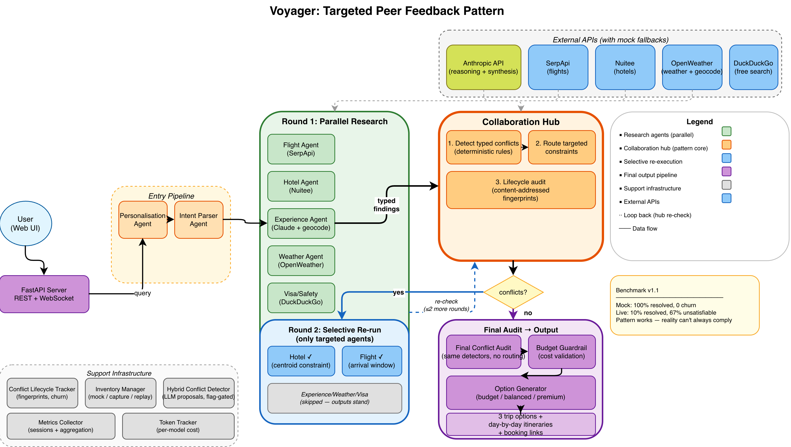

# Voyager: Targeted Peer Feedback for Multi-Agent Conflict Resolution

[](https://doi.org/10.5281/zenodo.21269753)

[](https://github.com/abhikank90/voyager-travel-agent/actions/workflows/ci.yml)

**A coordination pattern for multi-agent LLM systems: typed conflict detection, targeted peer feedback, and selective re-execution.** Voyager demonstrates the pattern on a real problem — multi-agent travel planning — where parallel specialist agents produce locally optimal but globally incoherent results. On synthetic inventory the pattern resolves 100% of conflicts; on real API inventory it honestly surfaces the ones reality can't satisfy.

| Metric | Synthetic inventory (25 queries × 2 modes) | Real API inventory (12 queries × 2 modes) |
|---|---|---|
| Round-1 conflicts / query | 2.0 | 1.2 |
| Final conflicts / query (full mode) | **0.0** (100% resolved) | **1.1** (10% resolved) |
| Unsatisfiable constraint rate | 0% | **67%** |
| Agent-call savings vs. full re-run | 30% | 41% |
| Cost overhead vs. baseline | +1.8% | **−3.5%** (full is cheaper) |
| Post-refinement introductions | 0 | 0.42/query |

*The synthetic/live contrast is the finding: the pattern resolves what's resolvable and honestly surfaces the rest. See [Benchmarks](#benchmarks) for methodology and caveats.*

---

## Demo


*Watch Voyager generate personalized trip options in real-time as agents collaborate to find flights, hotels, and experiences.*

---

## The Problem

The dominant pattern for multi-agent systems is **parallel fan-out/gather**: decompose a task, run specialist agents concurrently, merge results. It's fast and modular — and it has a structural flaw: **each agent optimizes locally with no knowledge of its peers' outputs.**

In travel planning, that looks like:

- The hotel agent books the best-value hotel — on the opposite side of the destination from every activity the experience agent selected.
- The flight agent picks the cheapest fare — landing at 22:30, wasting the first day of a 7-day trip.
- The experience agent plans beach days — during the week the weather agent flagged a heat wave.

Each output is individually defensible. The combination is incoherent. In our benchmark, every synthetic-inventory query and 83% of real-inventory queries produced at least one cross-agent conflict after the parallel round — and in a single-pass architecture, all of them ship to the user.

The well-documented fixes are expensive or imprecise:

- **Sequential pipelines** eliminate conflicts by serializing everything — and give up the latency win of parallelism.
- **Debate / generator-critic loops** re-run *all* agents with broadcast critique until convergence — effective, but cost scales with rounds × agents, and unstructured natural-language critique gives no guarantee the right agent gets the right constraint.

## The Pattern

Voyager inserts a **Collaboration Hub** between research rounds. It does three things, all deliberately narrow:

```
            ┌──────────────────────── Round 1 (parallel) ───────────────────────┐
            │  Flight    Hotel    Experience    Weather    Visa/Safety          │
            └──────────────────────────────┬─────────────────────────────────────┘
                                           ▼
                                 ┌──────────────────┐
                                 │ Collaboration Hub │
                                 │  1. detect typed  │
                                 │     conflicts     │
                                 │  2. route targeted│
                                 │     constraints   │
                                 └────────┬──────────┘
                          conflicts? ──── no ──→ final audit → budget guardrail → options
                                           │ yes
                                           ▼
            ┌────────── Round 2 (selective — only agents that received messages) ─┐
            │            Hotel ✓          Flight ✓        (others skipped)        │
            └──────────────────────────────┬───────────────────────────────────────┘
                                           ▼
                                 (hub re-checks; ≤1 more round)
```

**1. Typed conflict detection (deterministic by design).** The hub checks the merged state against a registry of *typed* conflict rules — `location_mismatch`, `timing_inefficiency`, `weather_activity_mismatch` — each a cheap, deterministic predicate over structured agent outputs. Detection is intentionally rule-based rather than LLM-based: typed conflicts are what make the next two steps possible. You can only route a constraint *to the hotel agent specifically* if you know *structurally* that the conflict is a hotel-location/activity-location mismatch. (The hub does call Claude once per round — to generate a narrative analysis surfaced in the UI; that narrative is deliberately ignored for routing.)

**2. Targeted constraint routing.** Each detected conflict generates a message addressed to the *one agent best positioned to resolve it*, carrying structured data, not prose: the hotel agent receives `{activity_centroid: {lat: 36.42, lon: 25.43}, activity_locations: ["Oia, Santorini", ...]}`; the flight agent receives `{preferred_arrival: "before 14:00"}`. The typed centroid is computed from geocoded experience coordinates — the experience agent resolves each activity's location string to lat/lon via a free geocoding endpoint, because substring matching against real hotel addresses cannot succeed. Detection, routing, and the feedback messages themselves are all deterministic; the only LLM work in a refinement round happens *inside* the agents that re-run.

**3. Selective re-execution.** Only agents that received messages re-run. Each rerunnable agent reads its inbox via `BaseAgent._messages_for_me()` and applies constraints at *selection time* — the hotel agent distance-matches candidates against the activity centroid; the flight agent prefers fares satisfying the arrival window — falling back gracefully when no candidate qualifies (`fallback_to_original_selection: true, reason: no_qualifying_option`). Agents that received nothing are skipped, and their Round-1 outputs stand.

A **final conflict audit** (same deterministic detectors, no routing) runs after the last round, so the system reports honestly which conflicts were resolved and which persist — persisting conflicts are surfaced, not hidden.

The round cap is the **shape of the graph**, not a configurable constant: `research_round_1`, `research_round_2`, and `research_round_3` are distinct hard-wired nodes, so the loop is bounded by topology rather than by a counter that a bug could mismanage.

### Why not just one big agent?

A single agent with all five specialties in one prompt avoids coordination entirely — and gives up parallelism, per-domain model/tool selection, independent testing, and bounded context per concern. The interesting regime is where you've *already* decided multiple agents are right (latency, modularity, separate data sources) and need coherence without paying the full debate-loop tax. That's what this pattern is for.

## Benchmarks

The benchmark runs queries through the full graph in two modes — *full* (hub routing + refinement) and *baseline* (Round 1 → audit → options, no routing) — across three inventory modes. Both modes run identical detectors at audit time, so final-conflict counts are directly comparable.

### Inventory Modes

| Mode | What it does | Network | Use case |
|---|---|---|---|
| `mock` | Deterministic fixtures, fully offline | None | CI, unit tests, reproducible benchmarks |
| `capture` | Hits real APIs (SerpApi, Nuitee, OpenWeather), saves hash-verified fixtures | Live | Measuring real-world behavior |
| `replay` | Re-runs against captured fixtures, zero network | None | Deterministic replay of real data |

Capture and replay must run the same day — effective trip dates are date-keyed to the capture date.

### Synthetic Inventory (25 queries × 2 modes = 50 sessions)

Fixtures are constructed so every query starts in conflict (location_mismatch + timing_inefficiency), making resolution precisely measurable. Mock hotels always contain a qualifying option near the suggested area.

| | Baseline | Full |
|---|---|---|
| Queries with ≥1 Round-1 conflict | 25/25 | 25/25 |
| Avg Round-1 conflicts / query | 2.0 | 2.0 |
| Avg conflicts in final output | 2.0 | **0.0** (100% resolved) |
| Converged after Round 2 | — | 25/25 |
| Post-refinement introductions | — | 0 |
| Reopened conflicts | — | 0 |
| Agent-call savings vs. full re-run | — | 30% |
| Avg cost / query | $0.1760 | $0.1754 |
| Avg latency / query | 248.4s | 224.8s |

Every conflict resolved by Round 2 with zero churn — the pattern works perfectly when the option space is satisfiable.

### Real API Inventory (12 queries × 2 modes = 24 sessions)

Real SerpApi flights, Nuitee hotels, OpenWeather forecasts. No guarantee that a qualifying hotel exists within 25km of the activity centroid, or that a flight arrives before 14:00.

| | Baseline | Full |
|---|---|---|
| Queries with ≥1 Round-1 conflict | 10/12 | 10/12 |
| Avg Round-1 conflicts / query | 1.3 | 1.2 |
| Avg conflicts in final output | 1.3 | **1.1** (10% resolved) |
| Converged after Round 1 | — | 2/12 |
| Converged after Round 3 | — | 4/12 |
| Post-refinement introductions | — | 5 (0.42/query) |
| Reopened conflicts | — | 0 |
| Unsatisfiable constraint rate | — | **67%** |
| Agent-call savings vs. full re-run | — | 41% |
| Avg cost / query | $0.1207 | $0.1165 (**−3.5%**) |
| Avg latency / query | 154.4s | 145.0s (**−6.1%**) |

**The mock/live contrast is the article's core finding.** On synthetic inventory, the pattern resolves 100% of conflicts by Round 2 with zero churn. On real inventory, resolution drops to 10% — not because the pattern fails, but because the dominant conflict class (location_mismatch) is frequently *unsatisfiable*: real hotel inventory within 25km of the activity centroid often doesn't exist. The pattern detects, routes typed constraints, and attempts resolution — but it cannot conjure inventory that doesn't exist. Instead, it surfaces the failure honestly: `fallback_to_original_selection: true, reason: no_qualifying_option`.

The 5 post-refinement introductions (0.42/query) are a behavior invisible to earlier instrumentation: the experience agent's LLM re-execution in Round 3 produces different activity sets, which create genuinely different location constraints (different fingerprints). Content-addressed conflict fingerprints make this churn visible; constant fingerprints would have masked it.

Full mode is *cheaper and faster* than baseline on real inventory ($0.1165 vs $0.1207, 145.0s vs 154.4s) — the hub's selective re-execution skips untargeted agents, and 2/12 queries had no conflicts at all (no refinement rounds needed).

### Reproduce

```bash
# Mock — deterministic, offline (~3h, ~$9 in tokens)
python scripts/benchmark_queries.py --mode compare --inventory mock

# Capture — live APIs (~45 min, ~$3 in tokens + sandbox calls)
python scripts/benchmark_queries.py --mode compare --inventory capture --query-count 12

# Replay — same day as capture, zero network (~40 min)
python scripts/benchmark_queries.py --mode compare --inventory replay --query-count 12

# Summary
python scripts/benchmark_queries.py --summary

# Hybrid LLM detector evaluation
python scripts/eval_hybrid_detection.py
```

Reproduce against tag `v1.1-infoq`.

### Three caveats

1. **Conflict incidence is a property of the workload.** Mock fixtures are constructed so every query starts in conflict — that's what makes resolution measurable. Real-inventory incidence (83%) reflects the query set and provider data, not a universal rate.
2. **Resolution rate measures coordination mechanics given the option space.** On mock, the space is always satisfiable (100%). On real inventory, satisfiability isn't guaranteed (67% unsatisfiable) — the pattern routes feedback to the right agent; it cannot create a hotel that doesn't exist. The claim: *given a satisfiable option space, the coordination layer resolves conflicts efficiently; given an unsatisfiable one, it surfaces that honestly.*
3. **Introductions reflect LLM nondeterminism, not oscillation.** The 5 introductions on live inventory come from the experience agent generating different activities in Round 3 — a different set of recommendations, not the system chasing its tail. Content-addressed fingerprints make this distinction measurable.

## Example: Location Conflict, End to End

A real trace from the live capture benchmark (Greece, $2,000, beaches and local food):

**Round 1 (parallel):** HotelAgent selects a hotel in Athens via Nuitee; ExperienceAgent's top activities cluster in *Navagio Beach, Zakynthos* and *Varvakios Agora, Athens* — geocoded to real coordinates.

**Hub:** `location_mismatch` detected → one constraint message, to the hotel agent only, with the typed activity centroid:

```json
{
  "to_agent": "hotel",
  "message_type": "constraint",
  "content": "Top experiences are located far from selected hotels.",
  "data": {
    "activity_locations": ["Navagio Beach, Zakynthos Island", "Varvakios Agora, Athens", "Elafonissi Beach, Crete"],
    "activity_centroid": {"lat": 37.8, "lon": 23.1},
    "current_hotel_location": "600 Center Place Drive, Greece, US (43.21,-77.67)"
  },
  "round": 1
}
```

**Round 2 (selective):** Only the hotel agent re-runs. It distance-matches Nuitee candidates against the centroid — no hotel within 25km exists in real inventory. Falls back honestly: `fallback_to_original_selection: true, reason: no_qualifying_option`.

**Audit:** `location_mismatch` persists. The system reports it rather than hiding it — and the wrong-geography hotel pick (Greece, NY for a Greece query) is itself a finding about real provider place resolution.

## System Architecture

<p align="center">
  <picture>
    <source media="(prefers-color-scheme: dark)" srcset="docs/diagrams/voyager-arch-dark.png">
    
  </picture>
</p>

**The application around the pattern:** Voyager is a full-stack travel planner producing three trip variants (budget / balanced / premium) with day-by-day itineraries and booking links.

- **Backend:** Python 3.11+, FastAPI, LangGraph state machine (`graph/travel_graph.py`) — nodes: `personalisation → intent_parser → research_round_1 → collaboration_hub_1 → [research_round_2 → collaboration_hub_2 → research_round_3] → final_conflict_audit → budget_guardrail → option_generator`, with conditional edges short-circuiting refinement when no conflicts fire.
- **Agents (11):** five parallel research agents (flight/SerpApi, hotel/Nuitee, experience/Claude+geocoding, weather/OpenWeather, visa-safety/DuckDuckGo), the Collaboration Hub, a budget guardrail (hard correctness gate, ≤2 retries), option generator, personalisation, intent parser, itinerary builder. All share a typed `TravelState` (`graph/state.py`).
- **Infrastructure:** conflict lifecycle tracker (content-addressed fingerprints), inventory manager (mock/capture/replay with hash-verified fixtures), metrics collector (session recording + aggregation), per-model token cost tracker.
- **AI:** Anthropic Claude — `claude-sonnet-4-6` for synthesis and hub/option generation, `claude-haiku-4-5-20251001` for the flight, hotel, and visa/safety research agents.
- **Frontend:** React 18 + TypeScript + Vite + Tailwind; live collaboration feed renders hub messages and per-round agent activity over WebSocket.
- **Infrastructure:** AWS (ECS Fargate, DynamoDB, SQS, ALB); LangSmith for observability.
- **External data:** real APIs when keys are present, deterministic mock fallbacks otherwise — see [API_REQUIREMENTS.md](API_REQUIREMENTS.md).

## Quick Start

```bash
git clone https://github.com/abhikank90/voyager-travel-agent.git
cd voyager-travel-agent
pip install -e ".[dev]"
cp .env.example .env        # add ANTHROPIC_API_KEY (only required key)
uvicorn api.main:app --reload          # backend
cd frontend && npm ci && npm run dev   # frontend
```

Full setup (Docker, AWS deployment, LangSmith): **[GETTING_STARTED.md](GETTING_STARTED.md)**.

```bash
# Run the test suite (200+ tests)
python3 -m pytest tests/unit -q

# Run the benchmark yourself
python3 scripts/benchmark_queries.py --inventory mock --limit 3      # smoke test (~$0.50)
python3 scripts/benchmark_queries.py --inventory mock --mode compare # full mock benchmark (~$9, ~3h)
```

## Design Decisions

**Deterministic detection, LLM reasoning.** LLM does what it's good at — parsing intent, generating experiences, synthesizing options, narrating analysis. Conflict detection stays rule-based because typed conflicts are the contract that targeted routing and selective re-execution depend on, and because deterministic detection makes benchmarks reproducible. A controlled evaluation (`scripts/eval_hybrid_detection.py`) measured an LLM detector against the rules on the same states: at temperature 0 it was fully self-consistent and caught conflict types the rules don't enumerate (visa lead-time, dietary preference, budget component sums), but it also asserted an unverifiable budget violation on a clean control case. The takeaway shapes the design — let the LLM *propose* candidate conflicts and let deterministic rules *validate* before anything triggers a re-run, since in this pattern a detection event spends money. Put another way: the LLM is allowed to be curious, the rules are allowed to be certain, and only certainty is allowed to spend money.

**One resolution direction per conflict type.** Bidirectional messages ("hotel, move near the activities" + "experiences, find some near the hotel") cause oscillation. Each conflict type names a single agent responsible for resolving it.

**Typed constraints, not prose.** The hub sends structured payloads — activity centroids from geocoded coordinates, arrival-time preferences, weather advisory labels — not natural-language suggestions. The hotel agent distance-matches against real coordinates; the flight agent filters by arrival hour. Substring matching against human-readable location strings does not survive contact with real inventory payloads. The typed payload's *producer* (experience agent) must emit the type the *consumer* (hotel agent) needs.

**Content-addressed conflict fingerprints.** Every conflict gets a SHA-256 identity from its type, agents, and normalized evidence data — never prose. This makes introduced/resolved/reopened classifications honest: the tracker can distinguish "same conflict persisting" from "new conflict introduced" across rounds. Without this, churn is invisible.

**Constraints filter selection; sources only need to contain a qualifying option.** Agents apply constraints when *choosing* among candidates rather than depending on data-source-specific query parameters — identical behavior across real APIs and mocks, robust to result ordering.

**Honest auditing.** The final audit uses the same detectors as Round 1 and reports unresolved conflicts in the output rather than suppressing them. On real inventory, 67% of full-mode queries end with at least one unsatisfiable constraint — the system reports `no_qualifying_option` rather than pretending success.

**Mock fallbacks for every external API.** The system is fully runnable with one API key, demos are deterministic, and CI needs no secrets.

## Limitations & Roadmap

Known limitations: resolution depends on a satisfiable option space (67% of real-inventory queries have unsatisfiable constraints); conflict coverage is currently three typed rules; the experience agent's LLM nondeterminism in Round 3 can introduce new conflicts (0.42/query on live inventory); the system re-attempts unsatisfiable constraints in Round 3 rather than relaxing them.

Roadmap:

- **Adaptive constraint relaxation** — when an agent reports `no_qualifying_option`, widen the constraint (e.g., 25km → 50km radius) or escalate to the user rather than re-attempting the same impossible constraint.
- **LLM-augmented conflict detection** — the hybrid detector (`agents/hybrid_conflict_detector.py`, flag-gated) lets an LLM propose candidate conflicts beyond the typed registry; deterministic validators gate routing authority. Current eval: perfect self-consistency, catches 3/3 rule-invisible conflict classes (visa timing, dietary, budget sums), but 0/10 candidates pass validation — the validators for those classes don't exist yet.
- **Validators for LLM-proposed conflict types** — write deterministic validators for visa lead-time, dietary preference, and budget component-sum classes, then re-measure the validated_extra rate.
- **Pattern extraction** — the hub, message protocol, and selective re-execution as a reusable LangGraph library independent of the travel domain.

## Documentation

📚 **Complete documentation for this project:**

- **[GETTING_STARTED.md](GETTING_STARTED.md)** - Installation, setup, and quick start guide
- **[ARCHITECTURE.md](ARCHITECTURE.md)** - Detailed component reference: all agents, state schema, API endpoints, frontend, benchmark methodology
- **[API_REQUIREMENTS.md](API_REQUIREMENTS.md)** - External API requirements, keys, and mock fallbacks
- **[TESTING.md](TESTING.md)** - Comprehensive testing guide with coverage targets

## License

MIT — see [LICENSE](LICENSE).